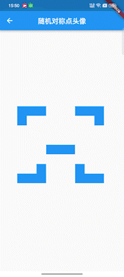
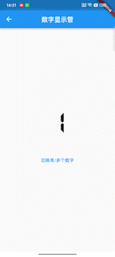

# flutter_unit

跟着掘金大佬[@张风捷特烈](https://juejin.cn/user/149189281194766)
学习flutter绘制内容，顺便复习巩固老知识点。

一、随机对称点头像生成：

[随机对称点头像生成代码文件](lib/random_symmetry_point)

预览：

<left></left>

二、路径篇 · 数字显示管

[数字显示管代码文件](lib/digital_display_tube)

预览：

<left><left/>

